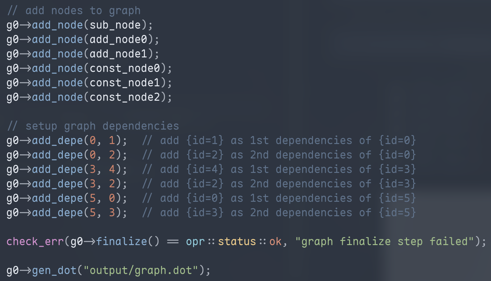
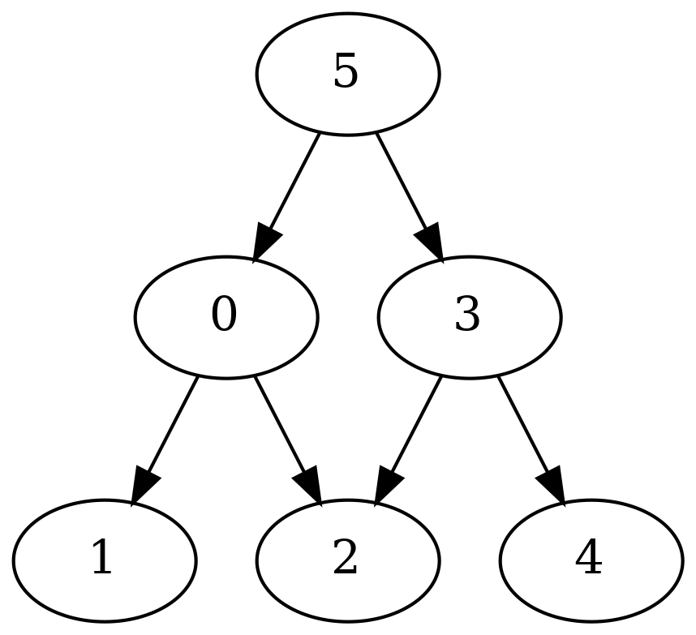

# OPR


A C++ library for efficient vector and matrix operations with multi-backend support, enabling users to create custom computational tasks.

## Table of Contents

- [Features](#features-todo-list)
- [Installation](#installation)
- [Examples](#examples)
- [Visualization](#graph-visualize)
- [Contact](#contact)

## Features TODO List
- [x] Vector operators
- [x] Sub-graph inside graph
- [x] CUDA + CPU backends support
- [x] Graph visualization
- [ ] Matrix operators
- [ ] OpenGL/OpenCL/Vulkan backends
- [ ] Examples crafting complex tasks
- [ ] Visualize all sub-graph inside master graph
- [ ] Documentation and user guide

## Installation

### Prerequisites
- C++17 or later
- CMake version 3.5 or later
- Ninja
- A compatible C++ compiler (e.g., GCC, Clang, MSVC)

### Installation Steps

```bash
# Clone the repository
git clone https://github.com/kiennt63/opr.git

# Navigate to the project directory
cd opr

# Build the project
./scripts/build.sh
```

## Examples
- Example code available in `examples` directory
- Binaries can be found in `build/debug/bin`
```bash
# Run cuda example
./scripts/run_example.sh
```

## Graph Visualize

- We use graphviz to visualize the computation graph
### Prerequisites
- Graphviz need to be installed
```
sudo apt-get install graphviz
```
### Visualization Steps
- Generate a dot file:
```
graph->gen_dot("output/graph.dot");
```
- Generate graph visualization image from the dot file
```
dot -Tpng output/graph.dot -o output/graph.png
```
<p align="center">
    
</p>

<p align="center">
    
</p>

## Contact

If you have any questions, suggestions, or issues, feel free to reach out:

- **Kien T. Nguyen**
- **Email:** [kiennt603@gmail.com](mailto:kiennt603@gmail.com)
- **LinkedIn:** [Kien T. Nguyen](https://www.linkedin.com/in/neikdev)
- **GitHub:** [kiennt63](https://github.com/kiennt63)

We appreciate your feedback and contributions to the project!